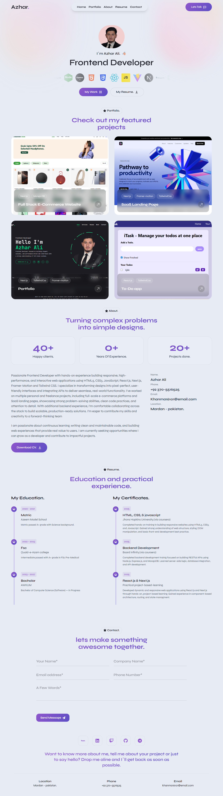

## 💻 Azhar Digital Studio

A modern personal portfolio website built with Next.js, React.js, Tailwind CSS, Framer Motion, and Node.js for backend utilities.
This project showcases a professional portfolio, including skills, projects, resume, and contact form with smooth animations and responsive design.

🔗 Live Demo: https://azhar-digital-studio.vercel.app
📂 Repository: https://github.com/AzharAli-web/Azhar-Digital-Studio

## 🚀 Features
### 🖥️ Portfolio Sections

Home: Introduction and professional summary
About: Education, skills, and personal background
Projects / Portfolio: Showcase of real-world projects
Resume: Downloadable resume in PDF format
Contact: Fully functional contact form for direct messages

### 🎬 Animations (Framer Motion)

Smooth page transitions
Interactive hover effects on buttons and project cards
Animated skill bars and project highlights

### 📱 Responsive Design

Mobile-first layout
Fully responsive for Mobile / Tablet / Desktop
Modern UI built with Tailwind CSS

## 🧱 Tech Stack
### Frontend
React.js
Next.js
Tailwind CSS
Framer Motion

### Backend / Utilities

Node.js (for contact form and server-side utilities)

### Deployment

Vercel

## 📂 Project Structure
Azhar-Digital-Studio/
├── app/ or pages/          # Next.js application routes
├── components/             # Reusable React components
├── hooks/                  # Custom React hooks
├── public/                 # Static images & assets
├── lib/                    # Node.js utilities & helper functions
├── styles/                 # Tailwind CSS and custom styles
├── data/                   # Sample data for skills, projects, etc.
├── screenshots/            # Screenshots for README / portfolio
├── next.config.js          # Next.js configuration
├── package.json            # Project dependencies
├── postcss.config.js       # Tailwind/PostCSS configuration
├── tailwind.config.js      # Tailwind configuration
├── tsconfig.json           # TypeScript configuration
├── .gitignore
└── README.md

## 📸 Screenshots

Add screenshots of your portfolio website:

## 🧠 What I Learned

Through this project, I strengthened my understanding of:
Building full-featured portfolio websites using Next.js and React
Creating animated UI with Framer Motion
Managing state and reusable components efficiently
Implementing responsive design with Tailwind CSS
Using Node.js for server-side functionality
Deploying production-ready applications on Vercel

## 🛠️ Installation & Setup
Clone the repository:
git clone https://github.com/AzharAli-web/Azhar-Digital-Studio.git
cd Azhar-Digital-Studio

Install dependencies:
npm install

Run the development server:
npm run dev

Open http://localhost:3000
 to view it in your browser.

## ⚡ Contact

I’m open to remote jobs, internships, and freelance projects. Let’s connect!

Email: khanma16101@email.com
Phone: +92 370-5516525
GitHub: AzharAli-web
Portfolio: azhar-digital-studio.vercel.app

## 🎯 Features Already Implemented

Fully responsive portfolio site with smooth UI animations
Projects section with interactive project cards
Downloadable resume in PDF format
Contact form powered by Node.js backend
Skill section with animated progress bars